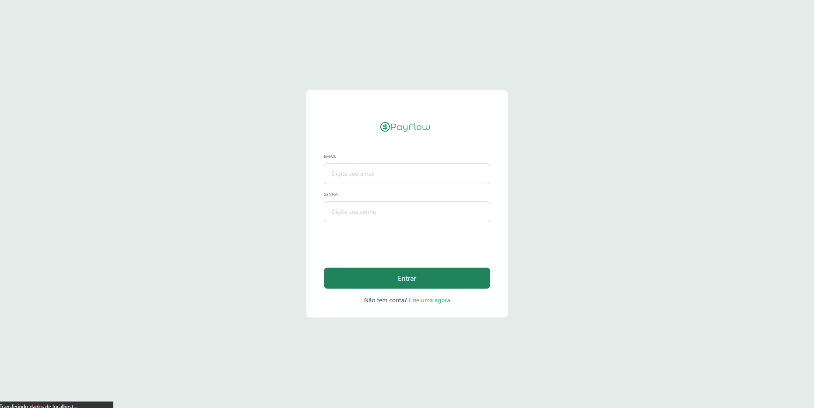
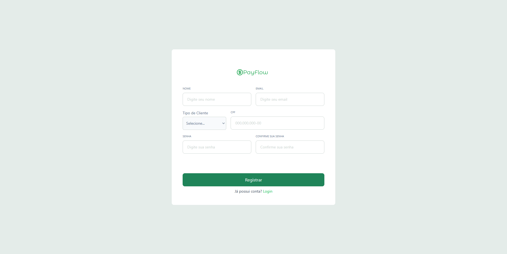
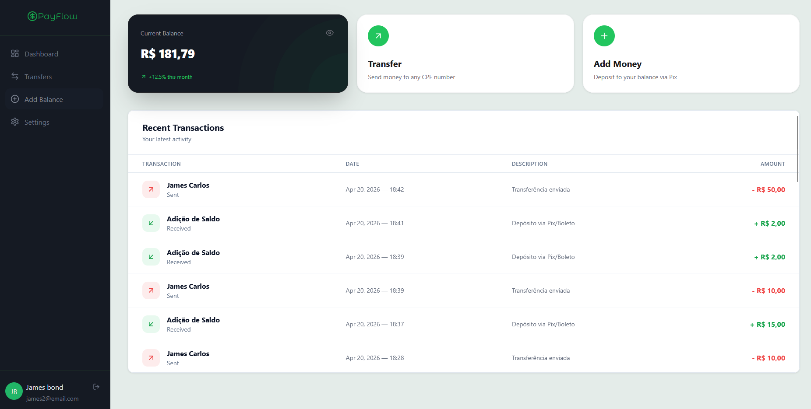
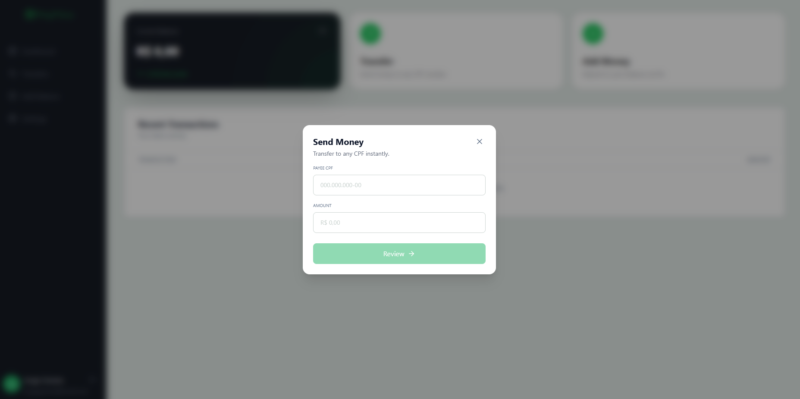

# 💳 Payment System - Web Client

A modern, responsive, and highly interactive web application built to consume the Payment System API (based on the PicPay backend challenge). This Single Page Application (SPA) allows users to manage their digital wallets, transfer money, make deposits, and track their transaction history in real-time.

## ✨ Features

- **Authentication System:** Secure login and registration flows with real-time input validation and masking (CPF formatting).
- **Interactive Dashboard:** A clean, intuitive interface displaying current balances and quick actions.
- **Real-Time Transactions:** - **Transfers:** Send money to any user instantly using their CPF.
  - **Deposits:** Add balance to your own account (Individual Clients/PF only).
- **Dynamic Statement:** A transaction history panel that updates automatically in the background (without page reloads) whenever a new transaction is completed.
- **Elegant UX/UI:** - Non-blocking toast notifications for success and error feedbacks.
  - Loading states to prevent double-submissions.
  - Centralized Modal management for a seamless overlay experience.

## 📸 Screenshots

<table>
  <tr>
    <td>SignIn</td>
    <td>Signup</td>
  </tr>
  <tr>
    <td></td>
    <td></td>
  </tr>
  <tr>
    <td>Dashboard</td>
    <td>Transaction</td>
  </tr>
  <tr>
    <td></td>
    <td></td>
  </tr>
</table>

## 🛠️ Tech Stack

- **Framework:** [React](https://reactjs.org/) with [Vite](https://vitejs.dev/)
- **Language:** [TypeScript](https://www.typescriptlang.org/)
- **Styling:** [Tailwind CSS](https://tailwindcss.com/)
- **State Management:** React Context API (`AuthContext`, `ModalContext`)
- **HTTP Client:** [Axios](https://axios-http.com/)
- **Schema Validation:** [Zod](https://zod.dev/)
- **UI Components:** - [React Icons](https://react-icons.github.io/react-icons/)
  - [React Hot Toast](https://react-hot-toast.com/) (Notifications)

## 🏗️ Architecture & Technical Highlights

- **Custom Events for Reactivity:** Implemented a `transactionSuccess` browser event pattern to decouple components. Modals can trigger background refreshes on the Dashboard's transaction table without complex prop-drilling.
- **Clean Form Validation:** Integrated Zod schemas decoupled from the UI, ensuring data integrity (e.g., exact 11-digit CPF validation) before hitting the API.
- **Context-Driven UI:** Used a global `ModalContext` to manage the visibility of various overlays (Transfer, Add Money) cleanly from anywhere in the component tree.

## 🚀 Getting Started

### Prerequisites
Make sure you have [Node.js](https://nodejs.org/) installed on your machine.

### Installation

1. Clone the repository:
   ```bash
   git clone https://github.com/Jorgeigor/paymentSystem-web.git
2. Navigate to the project directory:
```bash
    cd paymentSystem-web
```
4. Install the dependencies:
```bash

npm install
```
5. Configure the Environment Variables:
Create a .env file in the root directory and set your API URL (if different from the default):
```bash

VITE_API_URL=http://localhost:8080
```
6. Start the development server:
```bash
npm run dev
```
## 📂 Project Structure
```bash
src/
├── assets/         # Static files (images, logos)
├── components/     # Reusable UI components (Buttons, Inputs, Modals, Cards)
├── contexts/       # Global states (AuthContext, ModalContext)
├── hooks/          # Custom React hooks (useAuth, useModals)
├── pages/          # Application routes (SignIn, SignUp, Dashboard)
├── service/        # API configuration (Axios instances)
├── utils/          # Helper functions (currency formatting, class merging)
└── App.tsx         # Main application root
```
## 👤 Author
Developed by Jorge Igor Gomes

[](https://www.linkedin.com/in/jorge-igor-gomes/)